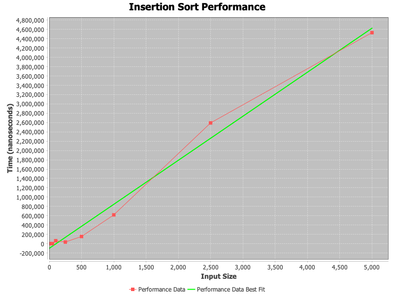

# Assignment 1: Sorting Algorithms Performance Analysis

> By Yazeed AlKhalaf | Student ID: 202211123 | SWE 429

## Introduction

This assignment analyzes the performance characteristics of three fundamental sorting algorithms through empirical testing. The implementation and analysis provide insights into how these algorithms behave with different input sizes and configurations.

I implemented a test harness in Java to evaluate the algorithms with various input sizes. The test arrays were randomly generated, but in a deterministic manner by seeding the `Random` class with `1337`. This seed can be modified to test different data distributions, but using a fixed seed ensures that the test arrays are reproducible across different environments.

## Algorithms Analyzed

1. **Insertion Sort**

   - A simple comparison-based algorithm that builds the sorted list one item at a time
   - Generally efficient for small data sets or nearly sorted arrays
   - Time complexity: O(n²) in worst case

   
   _Figure 1: Insertion Sort performance showing quadratic growth with input size_

2. **Merge Sort**

   - A divide-and-conquer algorithm that recursively divides the input array and merges sorted subarrays
   - Provides consistent performance regardless of input organization
   - Time complexity: O(n log n)

   
   _Figure 2: Merge Sort demonstrating logarithmic scaling behavior_

3. **Quick Sort**

   - Another divide-and-conquer algorithm using a pivot element
   - Typically very efficient in practice despite worst-case scenarios
   - Time complexity: O(n log n) average case, O(n²) worst case

   
   _Figure 3: Quick Sort performance exhibiting efficient average-case behavior_

## Comparative Analysis

_Figure 4: Comparative performance of all three sorting algorithms_

## Conclusion

The experimental results confirm theoretical expectations, with Insertion Sort showing quadratic growth for larger inputs while Merge Sort and Quick Sort demonstrate more efficient scaling. The specific characteristics of each algorithm make them suitable for different scenarios depending on input size and initial ordering.
